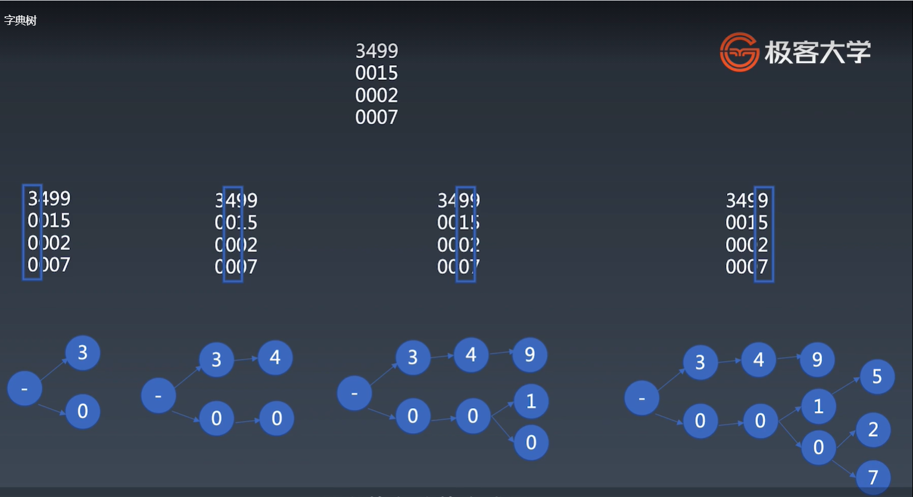
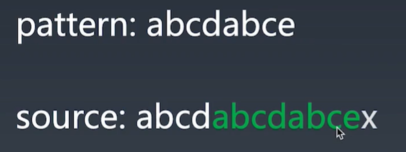
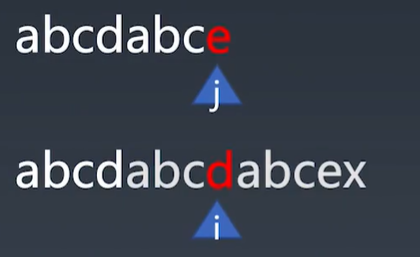
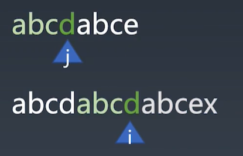
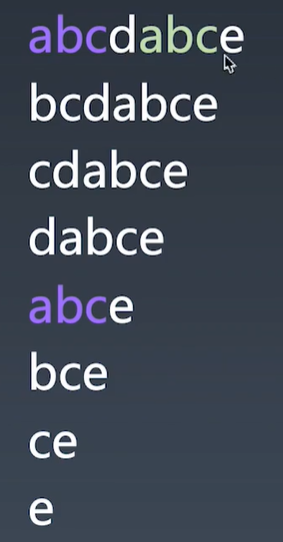
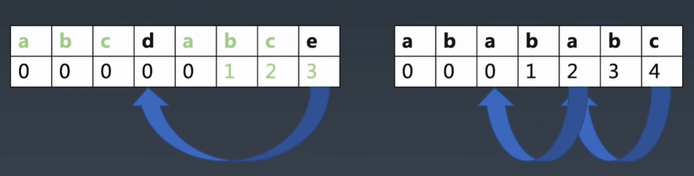
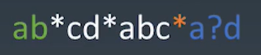

# 学习笔记

## 字符串分析算法

  * 字典树

    > 大量高重复字符串的存储与分析
    >
    > 比如：怎么处理 1 亿个字符串这里边有多少 ( 频率 ) 前 50 的数量的字符串？
    >
    > 两个字符串完全匹配

  - KMP 字符串模拟匹配算法

    > 在长字符串里找模式
    >
    > 一个字符串是另一个字符串的部分

  * Wildcard

    > 带通配符的字符串模式
    >
    > 在 KMP 的基础上又加了通配符，？——匹配任意字符、*——任意数量的任意字符，弱正则，贪心算法

  - 正则

    > 字符串通用模式匹配
    >
    > 回溯的系统、字符串模式匹配终极版本

  * 状态机
  
    > 通用的字符串分析
    >
    > 比正则更强大、跟正则完全等价的两种东西，有些状态机不同的是可以嵌代码、对字符串做额外处理，只是正则写起来很方便，而有限状态机写起来成本比较高、设计

  - LL LR

    > 字符串多层级结构分析
    >
    > LR 比 LL 更强大的语法分析，由于 LR 的理论性比较强所有简单写 LL ，前面的代码 stack 去处理就是 LR 算法的简化版，LR(0) 的语法，LR(1) 等于 LL(n) 的强大算法

## 字典树  

      什么是字典树？      
          通俗的讲，我们平时会查字典，我们查字典的时候，往往会根据单词的第一个字母，去进行查找。字典会有一个字典序，如果我们把看第一个字母的行为，不断的重复，那么当我们找到了第一个字母之后，再去看第二个字母，属于字典中的哪一个部分，然后把它变成一个树形的结构，相当于查字典的行为变成一个树形的结构，就是字典树——Trie。
  
  **字典树的基本存储方式**，如下图：
  
  

## KMP
    什么是 KMP ?
        KMP 是一个字符串的模式匹配算法，所谓模式匹配就是查一个字符串里有没有另一个字符串。那么它有一个原串，就是要待查的串；还有一个比较短的叫做 pattern 串，pattern 串就是用于表示说：我要在长串里面去找短的字符串。KMP 就是解决这样的问题的。

    朴素算法：Brute-Fotce(BF) —— 暴力解
        从长的字符串每一个节点位置开始，然后去匹配，看有没有能够匹配到 pattern 的串，这个算法的时间复杂度是 m 乘以 n。假如原串跟模式串它们两个的长度各为 m n 的话，那么它就是个 m 乘以 n 的时间复杂度。经过科学家的验证，不需要 m 乘以 n 时间复杂度。

## KMP问题
  - ### 如下图，假如 pattern 串 abcdabce，然后要到 source 串 abcdabcdabcex 查找里面有没有

    
    >
    > 会发现 source 绿色长串部分 跟 pattern 一模一样的可以匹配上
    >
    > 按照暴力算法，从 source 第一个开始算 匹不匹配

  * ### 如下图，假如我们用暴力算法

    
    >
    > 前面字符一直都是匹配的，带这个 e 的时候，才发现 pattern 串里面是 e ，source 串里面是 d
    >
    > 是不是有一些办法，能不能利用一下前面都已经是匹配上的结论呢？
    >
    > 图片里面可以看到 abcdabce 自身就是有重复的，如果串自身不重复，那么只要有一个不匹配，就认为可以从头开始了
    >
    > 因为自身重复，所以匹配到 d 的位置的时候，发现 d 和 e 不匹配的时候，就可以证明它前面的 abc(如下图)肯定是已经匹配了，所以 j 应该直接移回到 d 的位置
    
    
    >
    > 如上图，正好 pattern 串里面的 abcd 和 source 串里面的 abcd 匹配上了，那么又可以继续同时移动 i j 往前走，就不需要回到最前面去，再从 b 开始再重新从 b 和 a 开始重新匹配了

  - ### 如下图，计算机实现

    

    > 
    > 最关键的是要关注这个字符串的自重复行为，第一行紫色 abc 跟跟字符串头几个字母重复的，将字符串逐位的截短
    >
    > 先把第 1 位截掉，再把第 2 位截掉......截掉第 7 位然后再看有没有公共的最长的前面的子串
    >
    > 如图看到，第 5 行的 abce 跟前面 第 1 行的 abce 有一个公共的最长子串，就可以把紫色的 abc 匹配起来
    >
    > 经过计算，可以发现紫色的 abc 跟绿色的 abc 是同一段
    >
    > 这样就可以知道字符串是否具有自重复的特性

  * ### 如下图，如何描述自重复的特性？

    
    >
    > 在这里采用表格的形式，首先创建跟这个模式串长度相同的一个数组，然后在里面分别填上到此的时候已经有几个字母是重复的了
    >
    > 如图第一个表格例子，第二个 b 的时候，发现前面的一个 a 已经匹配到了，所以在这个表格里就标注了 1 ，到 c 的时候发现前面的 b 已经匹配到了所以标注 2 ，到 e 的时候前面 abc 都已经匹配到了，所以标注 3 ，那么当我们做原串跟模式串的对比的时候，如果发现模式串里面的 e 不能够匹配的话，那么不捉急回到最开始的状态，先看看前面有几位是重复的，那么就把重复的，先把模式串里面的位置跳到重复的位置。比如说 d ，就看 d 匹不匹配，如果 d 匹配的话，那么还是会从这个 d 开始继续往后去匹配。如果 d 也不匹配呢？因为 d 前面是 0 ，所以一步跳到 0 这个位置了，相当于从头再来。
    >
    > 如图第二个表格例子，最后到 c 的时候已经有 4 位匹配上了，那么它会回到 4 号位，而 4 号位我们发现，如果说原串里面的字母它不是 c 也不是 a 的话，那么我们会再往回跳一下，看看是不是第 2 个 a 的位置，如果不是跳回到 0 的位置也就是最开始的位置。—— 这个就是 KMP 匹配的一个回退的表格。
    >
    > KMP 首先根据模式串算出来跳转表格，然后拿这个跳转表格去跟原模式串做对比
    > 
    > 所以 KMP 算法大致分为两个部分： 
    > 1. 求跳转表格
    > 2. 进行真正的匹配

## Wildcard

    什么是 Wildcard ?
        Wildcard 是由星号 * 和问好 ? 混合起来的一种情况。
    
    解决 Wildcard 的问题 ?
        1. 又带星号又带问号是不好匹配的，所以必须先简化问题。
        2. 只考虑两种情况:
          a. 只有星号
          b. 只有问号

    Wildcard 比起前面的所有的 case 来说，是一个比较复杂的情况。因为加入了两种通配符，所以 Wildcard 让字符串的匹配变得没有那么的可控。

  

  - ### 分析只有星号 *

    
    >
    > 如上图，假设只有星号的模式串，那么在这个模式里面，会发现不同的星号会稍微有一些不同，首先想想，因为星号是这里面不确定性最高的一种符号。星号到底应该尽量匹配的多还是尽量匹配的少呢？
    >
    > 结论：其实最后一个星号跟前面的星号不一样的。因为最后一个星号可以尽可能的匹配多个字符，而不管前面剩了多少字符，那么最后一个星号其实都可以匹配到。因为星号是一个可以无限长，不管你匹配什么字符都可以，所以在最后一个星号之前的所有星号，如上图，所有的白色的星号可以尽量少的匹配，橙色的星号是要尽量多的匹配，除了最后一个星号之外，所有的白色星号都是尽量的少匹配。
    >
    > 此外，整个的模式里面还有两个特别的段，一个是 ab 这一段即开头一段，还有一个是 ad 这一段即结尾的段，绿色的部分只匹配开头的几个字符，蓝色的部分即最后一个橙色的星号后边的部分只匹配尾巴上的几个字符，（Wildcard 里面比较特殊的）。剩下的白色部分不管有多少段，这个星号相当于一个星号加上一段字符作为一组。
    >
    > 一个星号加上一个字符是什么意思呢？就是我在这个字符串里面去找一个特定 pattern 的字符，其实就是 KMP 算法。
    >
    > 这个星号匹配 cd 那么就是在字符里面找 cd 字符。abc 就是在边源字符串里面去找 abc 这个字符。如果去掉问号，那么一个 Wildcard 就是若干个 KMP 来组成的一个格式。如果加上问号，就可能要写一个比较复杂的算法，带问号的 KMP，但是带问号的 KMP 有点复杂，所以偷懒做法就是：发现一个字符串里找一个特定的 pattern 除了 KMP 算法还有什么办法呢？
    >
    > 答：正则（表达式）的 exec 也可以帮助我们去解决这个问题。如果我们把 wildcard 整个转换成正则表达式，那么它的性能一定是不合格的，但是通过逐段的转换成 exec 去处理正则表达式的话，那么它的性能就没有什么大的问题。

    

  

    

  

  