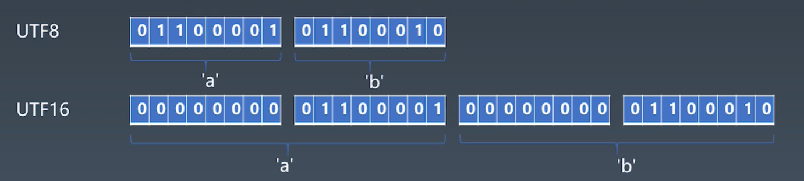
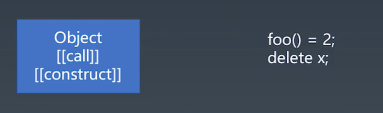

# 学习笔记

## JavaScript 语言通识 | 泛用语言分类方法

  * 语言按语法分类

    - 非语言形式

      > 特点：没有严格的定义。
      >
      > 典型代表：中文、英文。

    * 形式语言

      > 特点：形式化定义，非常严谨严格
      > 
      > 典型代表：数学课里面的定义方式
      >
      > 分类：乔姆斯基谱系

      


        * 0 型  无限制文法

          > 只要定义清楚了语言是什么样的

        - 1 型  上下文相关文法

          > 同样的一个词、句的组合是可以跟上文、下文的内容相关的

        * 2 型  上下文无关文法

          > 同样的一个表达无论放到哪都是一样的意思

        - 3 型  正则文法 -- regular

          > 所有能够被正则表达式直接去描述的

        注意：0 1 2 3 是一种上下包含关系，一个上下文相关文法，一定属于 0 型，但是反过来就不一定了...

## JavaScript 语言通识 | 什么是产生式

  * 什么是产生式

        

    - ### 最经典最常用的生产式描述方法

      - 用尖括号括起来的名称来表示语法结构名

      * 语法结构分成基础结构和需要用其他语法结构定义的复合结构

        - 基础结构称终结符 ( Terminal Symbol )

        * 复合结构称非终结符 ( Nonterminal Symbol )

      - 引号和中间的字符表示终结符

      * 可以有括号

      - **`*`** 表示重复多次

      * **`|`** 表示或

      - **`+`** 表示至少一次

    * ### 用 BNF 来描述四则运算

      <html>
        <body>

          <MultiplicativeExpression>::=<Number>|
            <MultiplicativeExpression>"*"<Number>|
            <MultiplicativeExpression>"/"<Number>|

          <AdditiveExpression>::=<MultiplicativeExpression>|
            <AdditiveExpression>"+"<MultiplicativeExpression>|
            <AdditiveExpression>"-"<MultiplicativeExpression>|

        </body>
      <html>

      - 四则运算：
      
        * 1 + 2 * 3

      * 终结符：
        
        - Number

        * **`+ - * /`**

      - 非终结符

        * MultipliactiveExpression

        - AddtiveExpression

      练习：编写带括号的四则运算产生式。

    - ### 通过产生式理解乔姆斯基谱系

      

      #### 思考：

        1. JavaScript 是上下文相关文法还是上下文无关文法？

        2. JavaScript 是否是正则文法？

        > 如果严格按照乔姆斯基谱系来理解，JavaScript 属于上下文相关文法。
        >
        > 乔姆斯基谱系相对来说是一个非常学术的定义方式，在 JavaScript 引擎实现上，可以理解为它总体的编程结构都是一个针对上下文无关文法的分析，一旦遇到像 get 这样上下文相关的地方就会单独的用代码做一些特例处理。一般来说也不会把 JavaScript 归结为上下文相关文法去处理。严格意义上，只要有一个特例就会变成更泛的类型，这就是如何从产生式的角度去理解乔姆斯基谱系。

    * ### 其它产生式 EBNF ABNF Customized

      > EBNF ABNF Customized 都是针对 BNF 做了一个写语法上的扩展。

      <html>
        <body>

          JavaScript 里面标准书写产生式的例子：

            AdditiveExpression :
              MultiplicativeExpression
              AdditiveExpression +
            MultiplicativeExpression
              AdditiveExpression -
            MultiplicativeExpression
          
        </body>
      <html>

## JavaScript 语言通识 | 现代语言的分类

  - ### 现代语言的特例

    * C++ 中，**`*`** 可能表示乘号或者指针，具体是哪个，取决于星号前面的标识符是否被声明为类型。
    
      > 导致了 C++ 变成了不是形式语言，因为要去语义里面取内容，但是 C++ 整个的语法分析本身还是一个形式语言的结构。

    - VB 中，**`<`** 可能是小于号，也可能是 XML 直接量的开始，取决于当前位置是否可以接受 XML 直接量。
    
      > 所以就会是一个上下文相关的文法。

    * Python 中，行首的 tab 符和空格会根据上一行的行首空白以一定规则被处理成虚拟终结符 indent 或者 dedent.
    
      > Python 的处理导致了 Python 也变成一个完全的非形式语言，因为任何的形式化定义都没有办法定义上一行行首的概念，所以在 Python中，虽然还是可以被代码取进行处理，只要处理过了，Python 就是一个严格的形式化语言，而且是一个上下文无关文法。

    - JavaScript 中，**`/`** 可能是除号，也可可能是正则表达式开头，处理方式类似于 VB ，字符串模板中也需要特殊处理 **`}`** ，还有自动插入分号规则。

  * ### 语言的分类

    - 形式语言 —— 用途

      * 数据描述语言

        > JSON、HTML、XAML、SQL、CSS，本身没办法进行编程。

      - 编程语言

        > C、C++、Java、C#、Python、Ruby、Perl、Lisp、T-SQL、Clojure、Haskell、JavaScript，比较新的偏声明式的函数语言，可以编程。

    * 形式语言 —— 表达方式

      - 声明式语言

        > 只告诉结果怎样的。
        >
        > JSON、HTML、XAML、SQL、CSS、Lisp、Clojure、Haskell，发现大部分的数据描述语言都是声明式的。

      * 命令式语言

        > 达成结果的每个步骤是怎样的。
        > 
        > C、C++、Java、C#、Python、Ruby、Perl、JavaScript。

    练习：尽可能寻找你知道的计算机语言，尝试把它们分类。

## JavaScript 语言通识 | 编程语言的性质

  - ### 图灵完备性

    > 所有的可计算的问题都可用来描述的语言就是具备图灵完备性的。

    - 命令式 —— 图灵机

      * goto

      - if 和 while

    - 声明式 —— lambda

      > 邱奇提出 lambda 演算，可以理解为数学上定义的一种 lambda 函数，和现在的函数比较相似，基本意思就是一种替换的关系。

      * 递归

  * ### 动态于静态

    - 动态：

      * 在用户的设备/在线服务器上

      - 产品实际运行时

      * Runtime

    * 静态：

      - 在程序员的设备上

      * 产品开发时

      - Compiletimes

  - ### 类型系统

    * 动态类型系统于静态类型系统

      > 动态类型系统：在用户的机器上、内存里面能够找到的类型；JavaScript。
      >
      > 静态类型系统：只在程序员编写代码的时候能够保留的类型信息；C++ 。
      >
      > 区分：在谁的电脑上能够保留下来，像 Java 一类的语言因为提供了反射机制，所以是一种半动态半静态的类型系统，在编译时只要的类型检查和类型操作都已经在编译时被处理掉了，如果想在运行时获得类型信息可以通过反射获取。

    - 强类型与弱类型

      > 强类型与弱类型只是说明在编程语言里类型转换发生的形式。
      >
      > 强类型的语言类型转化不会默认发生，像 JavaScript 就是典型的弱类型语言。

      * String + Number

      - String == Boolean

    * 复合类型    

      - 结构体

            {
              a: T1, 
              b: T2
            }

      * 函数签名

        > 函数签名包含参数类型（列表）和返回值类型

            (T1, T2) => T3

    - 子类型

      > 典型的语言 C++ ，子类型的概念，所有基于面向对象的编程语言都会把类和结构关系变成类型的关系。
      >
      > 注意：类和类型事两个概念。

    * 泛型

      > 范式：范型编程，可以把这个类型当作一个参数传递给某一段代码结构，这个代码结构有可能是类（泛型类）也有可能是函数（泛型函数）。

      - 逆变/协变

        > 范型和子类型相结合，会产生逆变、协变。

            协变：
                凡是能用 Array<Parent> 的地方，都能用 Array<Child>。

            
            逆变：
                凡是能用 Function<Child> 的地方，都能用 Function<Parent>。

        > 如果范型跟不同类型系统的特征相结合，会形成一个非常复杂的类型机制。
        >
        > 在类型论里面，类型推导和像逆变、协变加上子类型、复合类型，这些结构上面一直有一些未解的难题。

## JavaScript 语言通识 | 一般命令式编程语言的设计方式
   
  - ### 一般命令式语言总的结构分成 5 个层级：

    1. 原子级：语言最小的组成单位，通常包含一些关键字、直接量、变量名基本的单位

    2. 表达式：原子级的这些结构通过运算符相连接，加上一些辅助的符号。

    3. 语句：表达式加上一些特定的标识符、特定的关键字、特定的符号形成一定的结构。

    4. 结构化：把代码分成不同的块，然后分成不同的复用结构，也会使用像关键字来形成结构化的结构。

       > PASCAL : 古老的语言，通常被用作教科书的一门语言，有 Process 这个概念所谓的过程。 

    5. 组织代码：去更好的管理语言的模块和安装，在 JavaScript 里面通常做 npm 角色。
    
       > JavaScript 本身也有两个最顶级的定义：program（实际执行的代码） 、module（准备好被复用的模块）。

    

## JavaScript 类型

  

  * ### JavaScript 的 Types： 7 种标准类型 | 常用的基本类型前 5 种 | 1 种现行

    - 一般的对象

      - Number

        * IEEE 754 Double Float

          > 基本思想： 把一个数字拆成它的指数和有效位数 ，这个数的有效位数是决定了浮点数表示的 **精度** ；这个指数决定了浮点数表示的 **范围** 。 
        
          - Sign（1）

          * Exponent（11）

          - Fraction（52）

          ### 64 位双精度浮点数的比特位分布图（二进制）：

            > 蓝色的表示符号，如果是 1 表示负的，如果是 0 表示正的，黄色的表示指数位，白色的表示精度位。
            >
            > 最后得到 float 就是一个精度位乘以指数位，乘以 2 的指数次方，指数有一个偏移，因为 11 位不光是为了表示说正的，还有一个表示负的范围，所以会从 1 个 1 后边 10 个 0，从这个开始比这大的就表示正的，比这个小的表示负的，所以指数位有一个基准值，要减掉基准值才是真实的 2 的这么多次方。
            >
            > 表示最大的数：10 个 1，2 的 2048 次方减 1，2 的乘方再乘以一个 52 个 1 
            >
            > 表示最小的数：负的全是 0，基准值是 1 后边 10 个 0，所以 表示 2 的 负 10 次方。
            > 
            > 52 隐藏位：再白的第一位之前，是一定有一个 1 的。因为精度一定是以 1 开头的，没必要把这个 1 表示出来，所以最后有一个隐藏位，这样的话最小值就是一个 1 后面 52 倍，然后再乘以一个 2 的负 10 次方。

        - Number  —— Grammar ( 2018 标准 ) 

          * Decimalliteral ( 十进制 )

            - 0

            * `0.`
              >
              > `0.toString()` => `0 .toString()`，加空格 **`.`** 才会被理解位取属性的运算符

            - `.2`

            * 1e3 ( 1000 )

          - BinaryIntegerLiteral ( 二进制 )

            * 0b111

          * OctalIntegerLiteral ( 10 进制 )

            - 0o10

          - HexIntegerLiteral ( 16 进制 )

            * 0xFF


      * String

        - 运行时角度

            深入的理解字符、码点、编码方式。

          - Character

          * Code Point      

            - ASCLL

              > 只规定 127 个字符，包括 26 个大写字母、26个小写字母、0-9数字、各种制表符和各种特殊的符号、换行字符控制字符。

            * Unicode

              > Unicode 联合的编码集 —— 字符大合集。数量大、划分片区

            - UCS

              > 只有 0000 ~ FFFF 范围的字符集

            * GB

              > 范围小

              - GB2312 ( 国标第一个版本 )

              * GBK ( GB13000 )

              - GB18030

            - IOS-8859

              > 东欧国家

            * BIG5
              
              > 台湾 -- 大五码

          - Encoding

            * UTF

              
              

          * Homework

            > ```function UTF8_Enicoing(string) {```
            >
            > ```　　// return new buffer();```
            >
            > ```　　// 写一段 JS 函数把一个 string 代表的字节给转换出来，用 UTF8 对 string 进行编码。```
            >
            > ```}```  

            **参考链接：**
              [《JavaScript 类型：关于类型，有哪些你不知道的细节？》](https://time.geekbang.org/column/article/78884)

        * 语法角度

          - 早年的 JavaScript 支持

            * 双引号字符串："abc"

            - 单引号字符串：'abc'

          * 新版本 JavaScript 支持

            - 反引号字符串：`` `abc` ``

          - 练习
            
            > A regular Expression to match string literal.
            > 
            > 用正则表达式来匹配单引号和双引号的字符串写法。
            >
            > ES5 的写法 | Grammar Answer：
            >
            > `"(?:[^"\n\\\r\u2028\u2029]\\(?['"\\bfnrtv\n\r\u2028\u2029]|\r\n)|\\x[0-9a-fA-F]{2}|\\u[0-9a-fA-F]{4}|\\[^0-9ux'"\\bfnrtv\n\\\r\u2028\u2029])*"`
            >
            > `'(?:[^'\n\\\r\u2028\u2029]|\\(?:['"\\bfnrtv\n\r\u2028\u2029]|\r\n)|\\x[0-9a-fA-F]{2}|\\u[0-9a-fA-F]{4}|\\[^0-9ux'"\\bfnrtv\n\\\r\u2028\u2029])*`
            >
            > \n：换行符；\r：回到行首；2028：分段；2029：分页；\x：后跟 2 位十六进制数据；\u：后跟 4 位十六进制数据。
            >
            > Grammar -- Template：
            >
            > `` `ab${x}abc${y}abc` ``
            >
            > 

      - Boolean

        * true

        - false

        > 注意：true 和 false 都是关键字。

      * Object

        
        

        **对象不是由状态决定的，而是状态由对象决定的。**

        

          - Class

            

          * Prototype

            

          - Exercise

            * 狗咬人
            - “咬”这个行为该如何使用对象抽象？

              > 
              >
              > **为什么是错的？**
              >
              > 1. 不是现实中对象的行为，而是改变对象状态的行为。
              >
              > 2. 如果狗吃人，狗吃饱了，改变了狗的状态，勉强可以按到 bite 上面。
              > 
              > 3. 所以狗咬人可以基本上认为对狗的状态没有改变，而是人发生了变化。
              >
              > 4. 人身上是改变人的状态行为，要在人身上设计一个 biteBy 吗？被狗咬的方法？
              >
              > **对人来说，只需要关心受到了什么样的伤害，不关心狗如何了**
              >
              > 

          * Object in JavaScript

            

            - Property：属性，描述状态、行为、函数。
            * Prototype：原型。
            - 唯一标识性用内存地址表示对象唯一性。
            * 链式行为：一层一层往上找（不为空） —— 原型链。

      - Null：有值是空

        `function f() {`

        `　var null = 1; `

        `　console.log(null); `

        `}`

      * Undefined：值没被定义

        `function f() {`

        `　var undefined = 1; `

        `　console.log(undefined); `

        `}`

        > Null 是关键字不能作为变量名；把 undefined 变为最安全用 void 0。

      - Symbol

        * Object in JavaScript | 属性

          
          
          - JavaScript 属性是一个 kv 对，一种数据结构；特点：可以根据 k 找到 v。
          * JavaScript 属性 k 是两种类型：Symbol、String。
            - String：可以猜出来的一种 k，不管怎样弄拿到对象实例总能找到访问属性。
            * Symbol：在内存创建之后只能通过变量去引用，不能构造两个一模一样的 Symbol，特性跟对象有一些类似；实现了属性访问的权限控制。
              - 如果不把 Symbol 的名字传递给下一家，那么编写代码的使用者没有办法去访问用 Symbol 名字作为 k 的属性值。

          

            - JavaScript 的属性值部分有两种形态：
              * 数据属性：简单，符合正常意义上对数据属性的认知。
              - 访问器属性：多数时候用来描述行为，有的时候会同时描述状态和行为

        - Object in JavaScript | 原型机制

          

        * Object APL / Grammar

          - {} . [] Object.defineProperty

            1. 提供基本的对象机制
            2. 能够通过语法去创建对象
            3. 访问属性和定义新的属性以及去改变属性的特征值
          * Object.create / Object.setPrototypeOf / Object.getPrototypeOf —— 基于原型的对象 API
          - new / class / extends

            1. 新的语法结构
            2. 基于分类的方式去描述对象
          * new / function / prototype

            1. 历史包袱、不伦不类
            2. 长得有点像 Class base

          **前三种包含两个模式：基于原型、基于类，非常好的面向对象的描述方式。最后一种 ES3 版本不建议使用。**


      * BigInt

      > 总结：7 种基本类型 + 1 种正在制定途中，其中重点：
      >
      > 
      
      **建议：凡是进行过赋值的尽量用 Null，而不是用 Undefined。**

    * 特殊的对象

      - Function Object

        

        * typeOf 结果为 Function
        - 带 call 方法是一个内置行为，凡是使用双 方括号来定义的都是对象的内置行为，无论通过任何方式没有办法访问到。
        * 如果没有 call 行为访问会报错

      * Special Object

        

      - Host Object

        

        * Host Object 是 JavaScript 的语言标准没有去定义而是由宿主环境定义的
        - 原生 Host Object 可以去实现一些 JavaScript 语言里面并不支持但是 JavaScript 语法支持的一些特性
          * 比如说如果让一个函数返回一个引用对象，可以执行像右边的一个运算。
          - Host Object 也可以实现 call 方法甚至实现 construct 方法来支持函数调用和 new 运算
          * 带双 方括号的在 JavaScript 的代码中是调不到的，但是在调用 JavaScript 引擎的 C++ 代码或者是 C 代码中都是可以随便去实现和调用的。
          - 在 JavaScript 标准中有大量的使用双 方括号定义的私有方法，都是表示在 JavaScript 语言里面访问不到这个东西，但是在运行时里面又确实存在。

      * HomeWork

        - 找出 JavaScript 标准里面所有具有特殊行为的对象。
        * 也就是说 JavaScript 的里面定义的那些没有办法用普通对象，就是属性加原型来描述的对象行为。

          它们常见的下标运算（就是使用中括号或者点来做属性访问）或者设置原型跟普通对象不同：

            * Array：Array 的 length 属性根据最大的下标自动发生变化。
            - Object.prototype：作为所有正常对象的默认原型，不能再给它设置原型了。
            * String：为了不支持下标运算，String 的正整数属性访问会去字符串里查找。
            - Arguments：arguments 的非负整数型下标属性跟对应的变量联动。
            * 模块的 namespace 对象：特殊的地方非常多，跟一般对象完全不一样，尽量只用于 import 吧。
            - 类型数组和数组缓冲区：跟内存块相关联，下标运算比较特殊。
            * bind 后的 function：跟原来的函数相关联。

        **参考链接：**

          * [《JavaScript 对象：面向对象还是基于对象？》](https://time.geekbang.org/column/article/79319)
          - [《JavaScript 对象：我们真的需要模拟类吗？》](https://time.geekbang.org/column/article/79539)
          * [《JavaScript 对象：你知道全部的对象分类吗？》](https://time.geekbang.org/column/article/80011)


## 参考名词

  * [乔姆斯基谱系](https://zh.wikipedia.org/wiki/%E4%B9%94%E5%A7%86%E6%96%AF%E5%9F%BA%E8%B0%B1%E7%B3%BB) ：是计算机科学中刻画形式文法表达能力的一个分类谱系，是由诺姆 · 乔姆斯基于 1956 年提出的。它包含四个层次：
    - 0- 型文法（无限制文法或短语结构文法）包括所有的文法。
     
    * 1- 型文法（上下文相关文法）生成上下文相关语言。
    
    - 2- 型文法（上下文无关文法）生成上下文无关语言。
    
    * 3- 型文法（正规文法）生成正则语言。

  - [巴科斯诺尔范式](https://zh.wikipedia.org/wiki/%E5%B7%B4%E7%A7%91%E6%96%AF%E8%8C%83%E5%BC%8F) ：即巴科斯范式（英语：Backus Normal Form，缩写为 BNF），是一种用于表示上下文无关文法的语言，上下文无关文法描述了一类形式语言。它是由约翰 · 巴科斯（John Backus）和彼得 · 诺尔（Pater Naur）首先引入的用来描述计算机语言语法的符号集。

  * [图灵机（Turing machine）](https://zh.wikipedia.org/wiki/%E5%9B%BE%E7%81%B5%E6%9C%BA) ：又称确定型图灵机，是英国数学家艾伦 · 图灵于 1936 年提出的一种将人的计算机行为抽象掉的数学逻辑机，其更抽象的意义为一种计算模型，可以看作等价于任何有限逻辑数学过程的终极强大逻辑机器。

  - [图灵完备性](https://zh.wikipedia.org/wiki/%E5%9B%BE%E7%81%B5%E6%9C%BA)：在可计算性理论里，如果一系列操作数据的规则（如指令集、编程语言、细胞自动机）可以用来模拟单带图灵机，那么它是图灵完全的。这个词源于引入图灵机概念的数学家的艾伦 · 图灵。虽然图灵机会收到储存能力的物理限制，图灵完全性通常指 “ 具有无限存储能力的通用物理机器或编程语言 ”。

  * **终结符** ：最终在代码中出现的字符 ( https://zh.wikipedia.org/wiki/ 終結符與非終結符 ) 。

  - **产生式** ：在计算机中指 Tiger 编译器将原程序经过词法分析（Lexical Analysis）和语法分析（Syntax Analysis）后得到的一系列符合文化规则（Backus-Naur Form，BNF）的语句。

  * **静态和动态语言** ：https://www.cnblogs.com/raind/p/8551791.html 。

  - **强类型** ：无隐式转换。

  * **弱类型** ：有隐式转换。

  - **协变域逆变** ：https://jkchao.github.io/typescript-book-chinese/tips/covarianceAndContravariance.html 。      
        