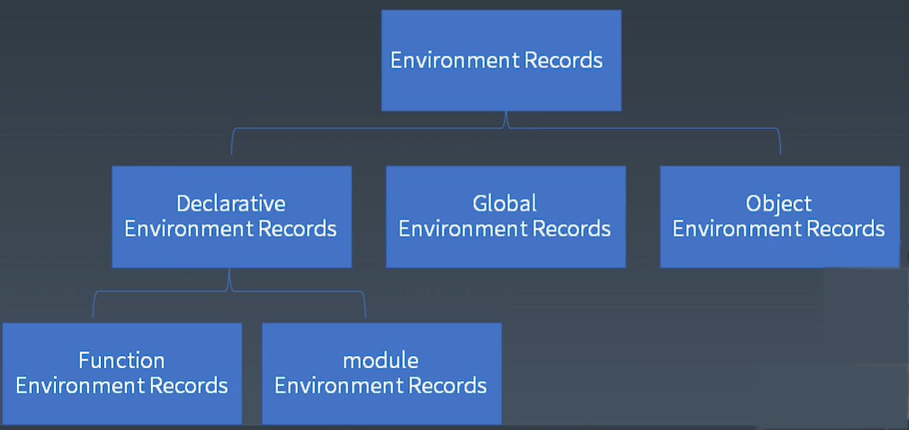
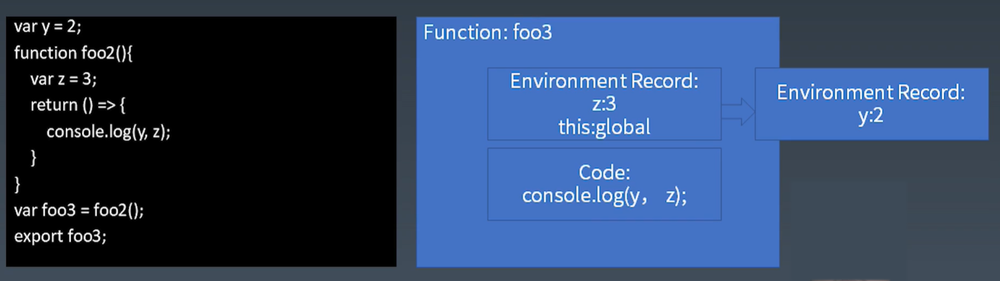

# 学习笔记

## 重学 JavaScript

  - ### JavaScript

    * Atom
    - Expression
    * Statement
    - Structure
    * Program / Module

  * ### JavaScript ( 从最小的单位逐渐构造成一个完整的语言 )

    - JS 表达式 | 运算符和表达式

      - Atom

        * Grammar
          - Grammar Tree vs Priority

            

            在 JavaScript 标准中，用产生式来描述运算符的优先级
          * Left hand side & Right hand side
        - Runtime
          * Type Convertion          
          - Reference
      * Expression - 优先级最高的运算符
        - Member
          * a.b
          - a[b]
          * ```foo`string` ```
          - super.b
          * ```super[`b`]```
          - new.target
          * new Foo()  - 优先级更高
          
            在运行时 Reference
            - Object - 对象
            - Key - String / Symbol
            * delete
            * assign
        - New 
          * new Foo

          Example：
            * new a()()
            - new new a()
        * Call - 函数调用，优先级低于 new 以及 menber 运算
          - foo()
          * super()
          - foo()['b']
          * foo().b
          - ```foo()`abc` ```
          
          Example：
            
            * new a()['b']

          **语法结构能够表达的内容是要多于运算符优先级所能表达的像这种点运算，它本身就可以有不同的优先级，它是它前面的语法结构来决定自己的优先级。**

        - Left Handside & Right Handside

          Example：

            * a.b = c; - Left Handside，有资格放到等号的左边
            - a+b = c  - Right Handside

        * Update - Right Handside
          - a ++
          * a --
          - -- a
          * ++ a

            Example：
    
              * ++ a ++
              - ++ (a ++)

        - Unary
          * delete a.b
          - void foo()
          * typeof a
          - +a
          * -a
          - ~a
          * !a
          - await a

        * Exponental

          - ** (平方)

          Example：

            - 3 ** 2 ** 3
            * 3 ** (2 ** 3)

        - 优先级低语法结构高

          * Multiplicative
            - *、 /、 &
          - Additive 
            * +、 -
          * shift
            - <<、 >>、 >>>
          - Relationship
            * <、 >、 <=、 >=、 instanceof、 in

        * 优先级再低一点

          - Equality
            * ==
            - !=
            * ===
            - !==

          * Bitwise
            * &、 ^ 、 |

        - 优先级最低的

          * Logical
            - &&
            * ||
          - Conditional - 三目运算符
            * ?、 : 

    * JS 表达式 | 类型转换

      - a+b
      * "false" == false
      - a[o] = 1;

      **7 种基本类型之间互相进行转换：**

        

        * Unboxing ( 拆箱转换 )

          > 拆箱转换：指把一个 Object 转成一个普通的类型基本类型，最主要的是 ToPremtitve 过程。

          - ToPrimititve
          * toString vs valueOf
          - Symbol.toPrimitive

            > 如果定义了 Symbol.toPrimitive 就会忽略 toString和 valueOf，否则在进行不同的转换时候，它会根据提示来决定调用 toString 和 valueOf 的先后

                栗子：
                  var = {
                    toString() { return "2" }, // 注释掉下面两个，打印得 x2
                    valueOf() { return 1 },
                    [Symbol.toPrimitive]() { return 3 } // 注释掉上面两个，打印得 x3
                  };
                  var x = [];
                  x[o] = 1; // 当 o 作为属性名，优先调用 toString
                  console.log("x" + o); // 这里的加法，优先调用 valueOf
                  // 最后注释掉 .toPrimitive 这一行，打印得 x2

        - Boxing ( 装箱转换 )
        
          > 在 Object 类型里面，因为 Object 它是可以有类概念的，那么对每个基础类型，Object 都提供了一个包装的类。
          
          **以下 4 种基础类型都有一个对应的包装类：**

            

            * Number：构造器，直接调用 Number 返回一个值；使用 new 调用返回一个 Object —— 就称这个 Number 对象和这个值 1 存在着一个装箱关系。
            - String：构造器。
            * Boolean：构造器。
            - Symbol：构造器，不能 new ，创建 Symbol 对象需要用 Object 构造器包一层。

            > 使用 Menber 点或方括号去访问属性的时候，如果点方括号之前的变量或者是表达式得到的是一个基础类型，那么就会自动调用装箱的过程，无需其他。
            >
            > 可以通过 typeof 去区分是包装后的还是包装前的值。

        


        * Exercise - HomeWork

          把 StringToNumber 和 NumberToString 两个函数互相类型转换。

              // 数字转换成字符串
              var n = 10.123;
              n.toString();
              n.toString(2);
              n.toString(8);
              n.toString(16);

              n.toFixed();
              n.toFixed(2);
              n.toFixed(5);

              n.toExponential();
              n.toExponential(3);
              n.toExponential(10);

              n.toPrecision();
              n.toPrecision(1);
              n.toPrecision(2);
              n.toPrecision(3);
              n.toPrecision(5);

              // 字符串转换成数字
              parseInt("0xa"); // 0x或0X后接啥啥啥转16进制
              parseInt("3 cheng"); // 开头数字字符后面忽略
              parseInt("cheng3"); // 非空格字符是非数字字符 返回 NaN

              parseInt("11", 2); // 第二个可选参数用来指定数字转换的基数
              parseInt("aa", 16);
              parseInt("11", 8);
              parseInt("11", 10);

              parseFloat("11ss"); // 类似 parseInt 用法

        **参考链接：**

        * [《JavaScript 词法：为什么 12.toString 会报错？》](https://time.geekbang.org/column/article/86400)
        - [《（小实验）理解编译原理：一个四则运算的解释器》](https://time.geekbang.org/column/article/86823)
        * [《JavaScript 语法（预备篇）：到底要不要写分号呢？》](https://time.geekbang.org/column/article/87179)
        - [《JavaScript 语法（一）：在 script 标签写 export 为什么会抛错？》](https://time.geekbang.org/column/article/87808)
        * [《JavaScript 语法（二）：你知道哪些 JavaScript 语句？》](https://time.geekbang.org/column/article/88538)
        - [《JavaScript 语法（三）：什么是表达式语句？》](https://time.geekbang.org/column/article/88827)
        * [《JavaScript 语法（四）：新加入的 ** 运算符，哪里有些不一样呢？》](https://time.geekbang.org/column/article/89151)        

    - JS 语句 | 运行时相关概念

      - Statement

        * Grammar
          - 简单语句
            * ExpressionStatement：表达式语句，完全由表达式组成；最核心的，真正的驱动
            - EmptyStatement：空语句，允许单独的分号

              控制语句：

            * DebuggerStatement
            - ThrowStatement
            * ContinueStatement：结束当次循环，继续后面的循环
            - BreakStatement：结束整个循环
            * ReturnStatement：函数里面用，返回函数值 
          * 组合语句
            - BlockStatement：一对花括号中间一个语句的列表，能够把所有需要单条语句的地方都变成可以用多一条语句，完成语句的树状结构重要基础设施

              > **block：** 可以容纳多个语句的 block，特殊字符展现花方块就相当于一个语句的位置
              >
              > 
              > * [[type]]：normal
              >  - [[value]]：--
              >  * [[target]]：--

            * IfStatement：分支结构，条件语句
            - SwitchStatement：多分支的结构，在 JavaScript 里面不建议使用
            * IterationStatement：循环结构，不是语句，while 循环、do-while 循环、for循环、For await 循环

              > **Iteration：** 比较大的结构
              >
              > 
              >
              > while 圆括号里面是跟一个表达式，然后后边是一个 statement
              >
              > do-while 是先一个 statement，然后后面有一个 while 表达式
              >
              > 白色比较多亮的块这个位置实际上是都可以加变量声明的
              >   - var
              >   * const / let
              >       > let 声明的域，for 语句会产生一个独立的 let 的声明的作用域的，
              >   - in

            - WithStatement：表达式，可以通过 with 打开一个对象，然后把这个对象的所有属性直接放进作用域里面去，节约空间、成本，不确定性也高，建议不使用
            * LabelledStatement：在简单语句、复合语句前面加上一个 label ，相当于给语句取一个名字，真正有效的地方是 IterationStatement 配上 labelled、break，continue 后边带 label 的
            - TryStatement：三段结构，包含了 try、catch、finally，try 不能省略花括号

              > **try：** 花括号一定得有
              >
              > 
              >
              > catch 产生作用域，catch 后面圆括号里面的变量被赋值为 try 里面抛出来的错误，还是可以有 label
              >
              > 在 try-catch-finally 里边，try 里面 return 了，finally 里面的代码也一定会继续执行

              标签、循环、break、continue
              
              * LabelledStatement
              - IterationStatement
              * ContinueStatement
              - BreakStatement
              * SwitchStatement

                > - [[type]]：break、continue
                > * [[value]]：--
                > - **[[target]]：Label**

          - 声明

            **函数声明：**
            * FunctionDeclaration

              > function
            - GeneratorDeclaration：

              >function *
            * AsyncFunctionDeclaration：异步的函数声明

              > async function
            - AsyncGeneratorDeclaration：异步的产生器

              > async function *

            **变量声明：**
            * VariableStatement：变量声明，既有声明的作用又有实际执行计算的能力

              > val

            - ClassDeclaration

              >calss
            * LexicalDeclaration

              > const、let

            <br>
            <br>

            预处理机制 ( pre-proocess ) --> 所谓处理是指在一段代码执行之前，JavaScript 引擎会对代码本身做一次预先处理

                var a = 2;
                void function () {
                  a = 1;
                  return;
                  var a;
                }();
                console.log(a); // 2
                // 理论上，return 之后 var a 是不会被执行到，但是预处理会提前去找所有的 var 声明的变量，并且生效，所以不管 var 写在哪个里面，都会被预处理挑出来，把这个变量声明到这个函数的作用级别。

                var a = 2;
                void function () {
                  a = 1;
                  return;
                  const a;
                }();
                console.log(a);
                // 此时的 a 成了局部变量，执行抛错，如果套一层 try-catch 结果为 2。

              **强调：所有的声明都是有预处理机制的，都能够把变量变成一个局部变量，区别是 const声明在声明之前使用会抛错，这个错误可以被 try-catch 处理。**

              <br>
              <br>

              **作用域：在代码里面变量从哪到哪发生作用**
              
              > 早年的 var 作用范围是整个函数体，前后都有
              > 
              > const 的作用域就在它所在的花括号。如果在循环语句，它的作用域就是整个循环语句，它比循环语句里面的花括号范围要大，因为每次循环都不产生新的。const 声明的范围就是自己外层的 block 语句
              >
              > 

              <br>

        - Runtime
          * Completion Record

                if (x === 1) 
                  return 10;

                我们需要一个数据结构来描述语句的执行结果：是否返回了？返回值是啥？等等……一些列的信息。

            - Completion Record 是怎么样组成的？

              * [[type]]：normal、break、continue、return、throw
              - [[value]]：基本类型
              * [[target]]：label

          - Lexical Environment
      * Structrue
      - Program / Module

    * JS 结构化 | 宏任务和微任务

      - JS 执行粒度 （运行时）
        * 宏任务

          > 宏任务就是传给 JavaScript 引擎的任务，语言讨论的最大粒度的范围。
        - 微任务（promise）

          > 微任务就是在 JavaScript 引擎内部的任务，由 Promise 来产生，在 JavaScript 里面，只有 Promise 会产生 微任务。
          >
          > 微任务里面不同的函数调用：下一层语句 / 声明，再下一层表达式，再再下一层直接量。
        * 函数调用（Execution Context）
        - 语句 / 声明（Completion Record）
        * 表达式（Reference）
        - 直接量 / 变量 / this ……

      - 宏任务与微任务

        

        > **宏任务与微任务的区分：**
        >
        > 1. 对于一个 JavaScript 引擎来说，它其实是一个静态库的形式，那么在使用 JavaScript 引擎的适合，会把一串代码传给它。
        >
        > 2. 这段代码里面并不是一个完全顺次执行的代码，代码里有一个 Promise 和 then 的逻辑，因为 then 已经被 resolve 掉了，它会立即继续执行，所以在 JavaScript 标准里定义，then 后面的代码应该是异步执行的。
        >
        > 3. 最后可以看到这个结论，塞给了 JavaScript 引擎的一段代码，但是它产生了两个异步任务，这两个异步任务第一个里面就是 `x = 1; p = new Promise; p.then()` 和 `x = 2` 的这一段代码，然后第二段就是 `x = 3` 的这段代码，这两个异步任务就把它称作一个 MicroTask，在 JavaScript 标准里把它叫做 job。
        >
        > 4. 最后会得到运行结果为 3，因为有两个微任务，所以最后输出的结果是其中一个微任务的结论，那么把这个代码塞给引擎并且进行执行的整个过程，称作 MacroTask，一个宏任务。

        在 oc 里边 调用 JavaScript call 引擎 ……

      * 事件循环

        

        如何去使用 JavaScript 引擎的过程？

        **参考链接：**

        - [《JavaScript 执行（一）：Promise 里的代码为什么比 setTimeout 先执行？》](https://time.geekbang.org/column/article/82764)
        * [《JavaScript 执行（二）：闭包和执行上下文到底是怎么回事？》](https://time.geekbang.org/column/article/83302)
        - [《JavaScript 执行（三）：你知道现在有多少种函数吗？》](https://time.geekbang.org/column/article/83719)
        * [《JavaScript 执行（四）：try 里面放 return，finally 还会执行吗？》](https://time.geekbang.org/column/article/83860)


           

        
    - JS 结构化 | JS 函数调用

      * 函数调用

        简单例子：

            import { foo } from "foo.js"

            var i = 0;
            console.log(i);
            foo(); // 访问不了 i = 0 声明的 i
            console.log(i);
            i++;

            function foo() {
              console.log(i); // 函数里面定义的 i ，如果没有定义报错
            }
            export foo;

        复杂例子：

            import { foo } from "foo.js"
            var i = 0;
            console.log(i);
            foo(); // 访问 x 变量
            console.log(i);
            i++;

            import { foo2 } from "foo.js"
            var X = 1;
            function foo() {
              console.log(X);
              foo2(); 访问 x 变量
              console.log(X);
            }
            export foo;

            var y = 2;
            function foo2() {
              console.log(y); // 访问 y 变量
            }
            export foo2;

                    

        - **stack：**

          

          stack 是一个从左到右按照图里的顺序生长的 stack，每一个stack 里所保存的东西称作为 EXecution Context 执行上下文，也就是执行一个语句的时候所需要的所有信息都会保存在这个 EXecution Context 里面，保存在 EXecution Context 的数据结构称作为 EXecution Context Stack —— 执行上下文栈。

          有一点特殊的是当执行到当前语句的时候，栈有一个栈顶元素，栈顶元素就是当前能访问到的所有变量，这些变量要给它起一个特殊的名字 —— Running Execution Content。

        * 那么 Execution Content 里面到底有什么？-- 七个部分

          

          - code evaluation state

            > 用于 async 和 generator 函数的，是一个代码执行到哪了的保存信息
          * Function

            > 由 Function 来初始化的 Execution Content
          - Script or Module

            > 要么有 Script 要么有 Module，只有两种这样的上下文
          * Genereator

            > Genereator 是只有 Gnerator 函数会需要，并不是 Genereator 函数，而是 Genereator 函数每次执行所生成的隐藏正背后的 Genereator。也就是只有 Genereator 函数 创建的执行上下文会有 Genereator 字段
          - Realm

            > 保存所有使用内置对象的领域
          * LexicalEnvironment

            > 代表了执行代码中所需要访问的环境，保存的变量
          - VariableEnvironment

            > 决定了用 var 去声明变量，会声明到哪的一个环境，

        - 实际上 Execution Content 分成几个不同的种类：
          * ECMAScript Code Execution Content
            - code evaluation state
            * Function
            - Script or Module
            * Realm
            - LexicalEnvironment
            * VariableEnvironment
          - Generator Execution Contents
           * code evaluation state
           - Function
           * Script or Module
           - Realm
           * LexicalEnvironment
           - VariableEnvironment
           * Generator
           

        - LexicalEnvironment -- 存所有的东西

          * this：`this.a = 1;`
          - new.target：`new.target;` 创建的 `Object`
          * super：`super();`
          - 变量：`X += 2;`

        * VariableEnvironment

          > 是个历史遗留的包袱，仅仅用于处理 var 声明，如果 var 声明出现在 eval 里面，就没有办法通过预处理去识别，所以专门给 eval 加 var 去进行处理。

              {
                let y = 2; // 声明到一个 block 范围的作用域里面
                eval('var x = 1;'); // 会把 x = 1 声明到一个更大的范围 Function body 里面或者 Script 或 Modulu 的范围里面
              }

              with({ a: 1 }) { // 用 with 声明的作用域里面它的变量像 var x 事会穿过 with 声明到更外层的 Function Environment
                eval('var x');
              }
              console.log(x);

        **多数时候 LexicalEnvironment 和 VariableEnvironment 是重合的。**

        - Environment Record

          > environment 并不是一个单纯的结构、池子，它会形成一个链式结构，链式结构里面的每一个节点称作一个 Environment Record。
          >
          > Environment Record 又有一个继承关系，基类叫 Environment Record，子类：
          >
          > 
          >
          > global 和 object 都是为了特殊场景使用。
          >
          > global 就只有一个，object 就是个 with 用的。
          > 
          > 平时大量会生成和产生的是 Declarative Environment Records，可以初始化，花括号的 block，形成自己的作用域，运行时会生成 Declarative Environment Records。

        - Function - Closure

          > 
          >
          > **在 JavaScript 里面每一个函数都会生成一个闭包，根据闭包的经典定义，闭包分成两个部分：代码部分和环境部分。**
          >
          > 环境部分：有一个 object 和一个变量的序列来组成的，在 JavaScript 里面每一个函数都会带一个它定义时所在的 Environment Records，会把 Environment Records保存到自己的函数对象身上，变成一个属性。
          >
          > 代码部分：每个函数有自己的 code。
          >
          > 在例子里面 function foo2 它定义的时候外边有一个 `y = 2`，所以不管这个 foo2 最后被通过参数或者是 export，import…… 传到哪里去，都会带上 `y = 2` Environment Records —— 闭包，也是 Environment Records 最后能形成链的关键设施。

          <br>

          > 
          >
          > foo3 在执行的时候，它的内部因为每次 foo2 的执行，都会在内部形成闭包，所以就会产生一个 `z = 3`。foo2 所在的环境 `y = 2` 就会被作为 `z = 3` 所在的环境的上级被保存下来 —— Environment Records 形成的链式结构（更早版本的名字 Scope Chain）。
          >
          > 因为有箭头函数的引入，`z = 3` 不但被保存下来，执行的时候所用的 this 也被保存下来了，this 是 global，所以这一条 Environment Records 里面有 `z = 3` 和 `this = global` 两条记录，加上更外层的的 `y = 2`，一共三条。  
          >
          > 在 return 后面的箭头函数里面，可以同时访问 y、z、this —— 闭包和作用域链的机制。
          
        * Realm

          > 在 JS 中，函数表达式和对象直接量均会创建对象。
          >
          > 使用：做隐式转换也会创建对象。
          >
          > 这些对象也是有原型的，如果我们没有 Realm，就不知道它们的原型是什么。
          >
          > 可以去执行对应的表达式，描述它们的行为。
          >
          > 根据一些外部的条件去创建不同的 Realm ，不同的 Realm 也可以互相传递对象，传递过来之后 Prototype 是不一致的。

              var x = {}; // 创建了一个 Object 对象
              1 .toString(); // 装箱产生 Number 对象，会用到 Realm

          > **规定：在一个 JavaScript 引擎的实例里面，所有的内置对象会被放进一个 Realm 里面，不同的 Realm 实例之间，它们是完全互相独立的。**


              HomeWork：直观感受一下 Realm

              尝试找出 JavaScript 引擎里面 Realm 里面所有的对象，然后使用一个 JS 的数据可视化框架（蚂蚁前端的 G6）把 Realm 做一个可视化，然后看看在一个 JS 的 Realm 里面究竟有多少对象。

