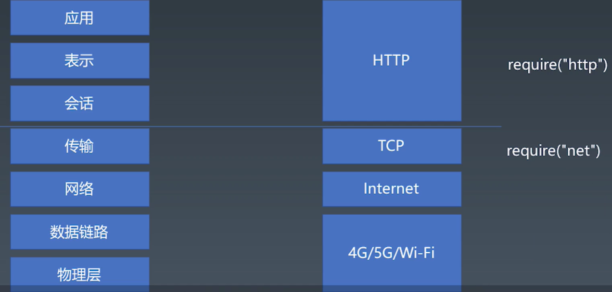
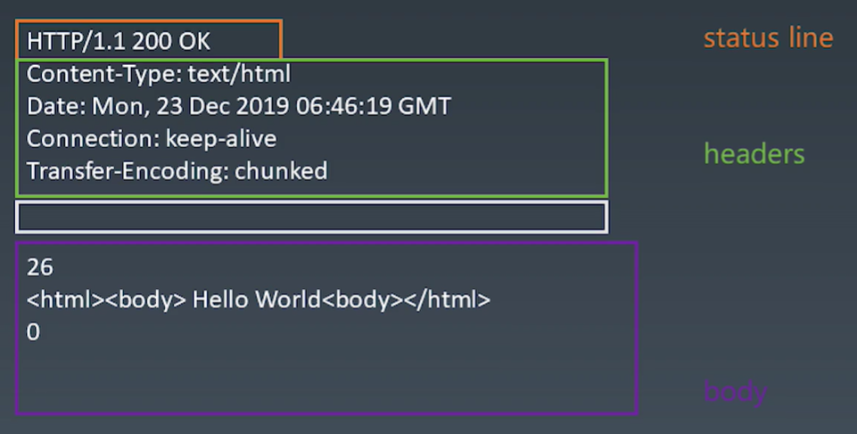

# 学习笔记 | 浏览器工作原理

## 1. 浏览器总论 | 浏览器工作原理

  ### HTTP 的基础知识 --> 游览器由以下 5 个步骤完成的整体渲染：

  

  > 浏览器的基础渲染流程：
  >
  > 手敲一个 URL，最终显示在屏幕上是一个图片的形式，这个过程叫 Bitmap。
  >
  > Bitmap：当 Bitmap 最后传给显卡驱动设备，才会转换人眼可识别的光信号。
  >
  > 所有浏览器的目标都是从一个 URL 最后得到一张 Bitmap 的过程是浏览器的基础渲染流程。
  >
  >  Toy-Browser

## 2. 状态机 | 有限状态机

  ### 有限状态机

  * 每一个状态都是一个机器
    - 在每一个机器里，我们可以做计算、存储、输出……
    * 所有的这些机器接受的输入是一致的
    - 状态机的每一个机器本身没有状态，如果我们用函数来表示的话，它应该是出函数（无副作用）
  - 每一个机器知道下一个状态
    * 每个机器都有确定的下一个状态 （Moore）
    - 每个机器根据输入决定下一个状态 （Mealy）
      * JS 中的有限状态机（Mealy）
        <pre>
          // 每个函数是一个状态
          function state(input) { // 函数输入就是输入
            // 在函数中，可以自由的编写代码，处理每个状态的逻辑
            return next; // 返回值作为下一个状态
          }
          // 以下是调用
          while(input) {
            // 获取输入
            state = state(input); // 把状态机的返回值作为下一个状态
          }
        </pre>

## 3. 状态机 | 不使用状态机处理字符串（一）

  * 在一个字符串中，找到 “a”

    <pre>
      function match(string) {
        for (let c of string) {
          if (c == "a") {
            return true;
          }
        }
        return false;
      }
      match("i am groot");
    </pre>

## 4. 状态机 | 不使用状态机处理字符串（二）

  - 在一个字符串中，找到字符 “ab”，不能使用正则表达式
  
    <pre>
      function match(string) {
        let foundA = false;
        for (let c of string) {
          if (c == "a") {
            foundA = true;
          }
          else if (foundA && c == "b") {
            return true;
          }
          else {
            foundA = false;
          }
        }
        return false;
      }
      console.log(mathc("i abm grood"));
    </pre>

## 5. 状态机 | 不使用状态机处理字符串（三）

  * 在一个字符串中，找到字符 “abcdef”，不能使用正则表达式

    <pre>
      function match(string) {
        let foundA = false;
        let foundB = false;
        let foundC = false;
        let foundD = false;
        let foundE = false;
        for (let c of string) {
          if (c == "a") {
            foundA = true;
          }
          else if (c == "b") {
            foundB = false;
          }
          else if (c == "c") {
            foundC = false;
          }
          else if (c == "d") {
            foundD = false;
          }
          else if (c == "e") {
            foundE = false;
          }
          else if (c == "f") {
            return true;
          }
          else {
            foundA = false;
            foundB = false;
            foundC = false;
            foundD = false;
            foundE = false;
          }
        }
        return false;
      }
      console.log(match("ababcdefg"));
    </pre>

## 6. 状态机 | 使用状态机处理字符串（一）

  - 在一个字符串中，找到字符 “abcdef”，不能使用正则表达式

    <pre>
      function match(string) {
        let state = start;
        for (let c of string) {
          // 把状态切到下一个
          state = start(c);
        }
        // 判断是不是已经找到了所有的状态
        return state === end;
      }
      function start(c) {
        if (c === "a") {
          return foundA;
        } else {
          return start;
        }
      }
      function end(c) {
        // 小技巧（trap）：让 end 状态永远返回 end，一旦进入到 end 状态就再也不会进别的状态
        return end;
      }
      function foundA(c) {
        if (c === "b") {
          return foundB;
        } else {
          return start(c); // 重新使用的逻辑 —— reConsume 逻辑
        }
      }
      function foundB(c) {
        if (c === "c") {
          return foundC;
        } else {
          return start(c);
        }
      }
      function foundC(c) {
        if (c === "d") {
          return foundD;
        } else {
          return start(c);
        }
      }
      function foundD(c) {
        if (c === "e") {
          return foundE;
        } else {
          return start(c);
        }
      }
      function foundE(c) {
        if (c === "f") {
          // 结束状态
          return end;
        } else {
          return start(c);
        }
      }
      console.log(match("ababcdefg"));
    </pre>

## 7. 状态机 | 使用状态机处理字符串（二）

  * 如何用状态机处理诸如 “abcabx” 这样的字符串？（状态机处理重复字符串）

    <pre>
      function match(string) {
        let state = start;
        for (let c of string) {
          state = start(c);
        }
        return state === end;
      }
      function start(c) {
        if (c === "a") {
          return foundA;
        } else {
          return start;
        }
      }
      function end(c) {
        return end;
      }
      function foundA(c) {
        if (c === "b") {
          return foundB;
        } else {
          return start(c);
        }
      }
      function foundB(c) {
        if (c === "c") {
          return foundC;
        } else {
          return start(c);
        }
      }
      function foundC(c) {
        if (c === "a") {
          return foundA2; // 找到第二个 a 的状态
        } else {
          return start(c);
        }
      }
      function foundA2(c) {
        if (c === "b") {
          return foundB2;
        } else {
          return start(c);
        }
      }
      function foundB2(c) {
        if (c === "x") {
          return end;
        } elsel {
          return foundB;
        }
      }
      console.log(match("abcabcabx"));
    </pre>
  - 额外内容

    * 我们如何用状态机处理诸如 “abcabx” 这样的字符串？
    - 作业：使用状态机完成 “abababx” 的处理。
    * 可选作业：我们如何用状态机处理完全未知的 pattern？
      - 参考资料：[字符串 KMP 算法](https://en.wikipedia.org.wiki.Knuth%E2%80%93Morris%E2%80%93Pratt_algorithm)

## 8. HTTP 请求 | HTTP 的协议解析
  
  * IOS - OSI 七层网络模型

    

  - TCP 与 IP 的一些基础知识
    * 流

      > 包
    - 端口
      
      > IP 地址      
    * require("net");
      
      > libnet ( 负责构造 IP 包并且发送 ) / libpcap ( 复负责从网卡抓所有的流经你电脑的网卡 IP 包 )

  * HTTP

    > TCP：全双工通道；全双工你可以给我发，我也可以给你发，不存在优先关系。  
    > HTTP：必须得先由客服端发起一个 request ，然后服务端回来一个 response。

    - Request
    * Response

## 9. HTTP 请求 | 服务端环境准备

  - 服务端环境的搭建

    <pre>
      const http = require('http');
      http.createServer((request, response) => {
        let body = [];
        request.on('error', err => {
          console.error(err);
        }).on('data', chunk => {
          body.push(chunk.toString());
        }).on('end', () => {
          // body = Buffer.concat(body).toString();
          body = body.join("");
          console.log('body：', body);
          response.writeHead(200, { 'Content-Type': 'text/html' });
          response.end(' Hello World\n');
        });
      }).listen(8088);
      console.log('server started');
    </pre>

  * 了解 HTTP 协议的 request 部分

    > HTTP 协议：是一个文本型的协议，文本型协议一般是跟二进制型协议相对的，文本型协议里面所有的内容都是字符串。

    

## 10. HTTP 请求 | 实现一个 HTTP 的请求

  - 第一步 HTTP 请求总结
    * 设计一个 HTTP 请求的类
    - Content-Type 是一个必要的字段，要有默认值
    * body 是 key / value 格式
    - 不同的 Content-Type 影响 body 的格式

    <pre>
      const net = require("net");
      class Request {
        constructor(options) {
          this.method = options.method || "GET";
          this.host = options.host;
          this.port = options.port || 80;
          this.path = options.path || "/";
          this.body = options.body || {};
          this.headers = options.headers || {};
          // 必须要有 Content-Type，不然 body 没办法解析
          if (!this.headers["Content-Type"]) {
            this.headers["Content-Type"] = "application/x-www-form-urlencoded";
          }
          // 2 种简单的编码格式
          if (this.headers["Content-Type"] === "application/json") {
            this.bodyText = JSON.stringify(this.body);
          } else if (this.headers["Content-Type"] === "application/x-www-form-urlencoded") {
            // 简单的 HTTP 保存
            this.bodyText = Object.keys(this.body).map(key => `${key}=${encodeURIComponent(this.body[key])}`).join('&');
          }
          // 不推荐设计成可以从外面传，一定是从 body 的 text 里面最后取一个 length 出来
          this.headers["Content-Length"] = this.bodyText.length;
        }
        send() {
          return new Promise((resolve, reject) => {
            resolve();
          });
        }
      }
      // 两步式的结构
      void async function () {
        // 创建 HTTP
        let request = new Request({
          method: "POST", // HTTP 协议
          host: "127.0.0.1", // 来自 IP 层
          port: "8088", // TCP 协议
          path: "/", // HTTP 协议
          headers: { // HTTP 协议
            ["X-Foo2"]: "customed"
          },
          body: {
            name: "cavon"
          }
        });
        // 请求结束，返回 promise
        let response = await request.send();
        console.log("response:", response);
      }();
    </pre>
## 11. HTTP 请求 | send 函数的编写，了解 response 格式

  * 第二步 send 函数总结
    - 在 Request 构造器中收集必要的信息
    * 设计一个 send 函数，把请求真实发送到服务器
    - send 函数应该是异步的，所以返回 Promise

    <pre>
      const net = require("net");
      class Request {
        constructor(options) {
          this.method = options.method || "GET";
          this.host = options.host;
          this.port = options.port || 80;
          this.path = options.path || "/";
          this.body = options.body || {};
          this.headers = options.headers || {};
          if (!this.headers["Content-Type"]) {
            this.headers["Content-Type"] = "application/x-www-form-urlencoded";
          }
          if (this.headers["Content-Type"] === "application/json") {
            this.bodyText = JSON.stringify(this.body);
          }
          else if (this.headers["Content-Type"] === "application/x-www-form-urlencoded") {
            this.bodyText = Object.keys(this.body).map(key => `${key}=${encodeURIComponent(this.body[key])}`).join("&");
          }
          this.headers["Content-Length"] = this.bodyText.length;
        }
        send() {
          return new Promise((resolve, reject) => {
            // 逐步的接受 response 的信息然后来构造 response 的对象各个不同的部分
            let parser = new ResponseParser;
            resolve("");
          });
        }
      }
      class ResponseParser {
        constructor() {}
        // 接口，接收一个字符串
        receive(string) {
          for (let i = 0; i < string.length; i++;) {
            this.receiveChar(string.charAt(i));
          }
        }
        // 状态机的代码
        receiveChar(char) {}
      }
      void async function() {
        let request = new Request({
          method: "POST",
          host: "127.0.0.1",
          port: "8088",
          path: "/",
          headers: {
            ["X-Foo2"]: "customed"
          },
          body: {
            name: "cavon"
          }
        });
        let response = await request.send();
        console.log(response);
      }
    </pre>

## 12. HTTP 请求 | 发送请求

  - 第三步 正式的进入到 HTTP 的 response 的 parser

    

  * 第三步总结：

    - 设计支持已有的 connection 或者自己创建 connection
    * 收到数据传给 parser
    - 根据 parser 的状态 去 resolve Promise
    <pre>
      const net = require("net");
      class Request {
        constructor(options) {
          this.method = options.method || "GET";
          this.host = options.host;
          this.port = options.port || 80;
          this.path = options.path || "/";
          this.body = options.body || {};
          this.headers = options.headers || {};
          if (!this.headers["Content-Type"]) {
            this.headers["Content-Type"] = "application/x-www-form-urlencoded";
          }
          if (this.headers["Content-Type"] === "application/json") {
            this.bodyText = JSON.stringify(this.body);
          } else if (this.headers["Content-Type"] === "application/x-www-from-urlencoded") {
            this.bodyText = Object.keys(this.body).map(key => `${key}=${encodeURIComponent(this.body[key])}`).join("&");
          }
          this.headers["Content-Length"] = this.bodyText.length;
        }
        send(connection) {
          return new Promise((resolve, reject) => {
            const parser = new ResponseParser;
            if (connection) {
              connection.write(this.toString());
            }
            else {
              connection = net.createConnection({
                host: this.host,
                port: this.port
              },
              () => {
                connection.write(this.toString());
              });
            }
            connection.on("data", data => {
              console.log(data.toString());
              parser.recevie(data.toString());
              if (parser.isFinished) {
                resolve(parser.response);
                connection.end();
              }
            });
            connection.on("error", err => {
              reject(err);
              connection.end();
            });
          });
        }
        toString() {
          return `${this.method} ${this.path} HTTP/1.1\r
                  ${Object.keys(this.headers).map(key => `${key}: ${this.headers[key]}`).join(`\r\n`)}\r\r
                  ${this.bodyText}`;
        }
      }
      class ResponseParser {
        constructor() {}
        receive(string) {
          for (let i = 0; i < string.length; i++) {
            this.receiveChar(string.charAt(i));
          }
        }
        receiveChar(char) {}
      }
      void async function() {
        let request = new Request({
          method: "POST",
          host: "127.0.0.1",
          port: "8088",
          path: "/",
          headers: {
            ["X-Foo2"]: "customed"
          },
          body: {
            name: "cavon"
          }
        });
        let response = await request.send();
        console.log(response);
      }();
    </pre>

## 13. HTTP 请求 | response 解析

  - 第四步 ResponseParser 总结
 
    * ResponseParser 必须分段构造，所以我们要用一个 ResponseParser 来 “装配”  
    - ResponseParser 分段处理 ResponseText，我们用状态机来分析文本的结构

  <pre>
    const net = require("net");
    class Request {
      constructor(opotions) {
        this.method = options.method || "GET";
        this.host = options.host;
        this.port = options.port || 80;
        this.path = options.path || "/";
        this.headers = options.headers || {};
        this.body = options.body || {};
        if (!this.headers["Content-Type"]) {
          this.headers["Content-Type"] === "application/x-www-from-urlencoded";
        }
        if (this.headers["Content-Tyep"] === "application/json") {
          this.bodyText = JSON.stringify(this.body);
        } else if (this.headers["Content-Length] === "application/x-www-from-urlencode") {
          this.bodyText = Object.keys(this.body).map(key => `${key}=${encodeURIComponent(this.body[key])}`).join("&");
        }
        this.headers["Content-Length"] = this.bodyText.length;
      }
      send(connection) {
        return new Promise((resolve, reject) => {
          const parser = new ResponseParser;
          if (connection) {
            connection.write(this.toString());
          } else {
            connection = net.createConnetion({
              host: this.host,
              port: this.port
            },
            () => {
              connection.write(this.toString());
            });
          }
          connection.on("data", data => {
            console.log(data.toString());
            this.receive(data.toString());
            if (parser.isFinished) {
              resolve(parser.response);
              connection.end();
            }
          });
          connection.on("error", err => {
            reject(err);
            connection.end();
          });
        });
      }
      toString() {
        return `${this.method} ${this.path} HTTP/1.1\r
                ${Object.keys(this.headers).map(key => `${key}: ${this.headers[key]}`).join("\r\n")}\r\r
                ${this.bodyText}`;
      }
    }
    class ResponseParser {
      constructor() {
        // 用常量然后用 if 去做区分的方法
        this.WAITING_STATUS_LINE = 0;
        this.WAITING_STATUS_LINE_END = 1;
        this.WAITING_HEADER_NAME = 2;
        this.WAITING_HEADER_SPACE = 3;
        this.WAITING_HEADER_VALUE = 4;
        this.WAITING_HEADER_LINE_END = 5;
        this.WAITING_HEADER_BLOCK_END = 6;
        this.WAITING_BODY = 7;

        // 初始状态
        this.current = this.WAITING_STATUS_LINE;
        this.statusLine = "";
        this.headers = {};
        this.headerName = "";
        this.headerValue = "";
        this.bodyParser = null;
      }
      receive(string) {
        for (let i = 0; i < string.length; i++) {
          this.receiveChar(string.charAt(i));
        }
      }
      receiveChar(char) {
        if (this.current === this.WAITING_STATUS_LINE) {
          if (char === "/r") {
            this.current = this.WAITING_STATUS_LINE_END;
          } else {
            this.statusLine += char;
          }
        } else if (this.current === this.WAITING_STATUS_LINE_END) {
          if (char === "\n") {
            this.current = this.WAITING_HEADER_NAME;
          }
        } else if (this.current === this.WAITING_HEADER_NAME) {
          if (char === ":") {
            this.current = this.WAITING_HEADER_SPACE;
          } else if (char === "\r") { // 说明是空行
            this.current = this.WAITING_HEADER_BLOCK_END;
          } else {
            this.headerName += char;
          }
        } else if (this.current === this.WAITING_HEADER_SPACE) {
          if (char === "  ") { // 冒号后面必然有空格分割
            this.current = this.WAITING_HEADER_VALUE;
          }
        } else if (this.current === this.WAITING_HEADER_VALUE) {
          if (char === "\r) {
            // 如果死等 等到 \r 的话
            this.current = this.WAITING_HEADER_LINE_END;
            // 就会把 暂存的 headerName、headerValue 写道 headers 上面
            this.headers[this.heanderName] = this.headerValue;
            this.headerName = "";
            this.headerValue = "";
          } else {
            this.headerValue += char;
          }
        } else if (this.current === this.WAITING_HEADER_LINE_END) {
          if (char === "\n") {
            this.current = this.WAITING_HEADER_NAME;
          }
        } else if (this.current === this.WAITING_HEADER_BLOCK_END) {
          if (char === "\n") {
            this.current = this.WAITING_BODY;
          }
        } else if (this.current === this.WAITING_BODY) {
          console.log("额外的处理暂时不做", char);
        }
      }
    }
    void async function () {
      let request = nre Request({
        method: "POST,
        host: "127.0.0.1",
        port: "8088",
        path: "/",
        headers: {
          ["X-Foo2"]: "customed"
        },
        body: {
          name: "cavon"
        }
      });
      let response = await request.send();
      console.log(response);
    }();
  </pre>

## 14. HTTP 请求 | response body 的解析

  * 第五步 BodyParser 总结

    - Response 的 body 可能根据 Content-Type 有不同的结构，因此我们会采用子 Parser 的结构来解决问题
    * 以 TrunkBodyParser 为例，我们同样用状态机来处理 body 的格式

  <pre>
    const net = require("net");
    class Request {
      constructor(options) {
        this.method = options.method || "GET";
        this.host = options.host;
        this.port = options.port || 80;
        this.path = options.path || "/";
        this.body = options.body || {};
        this.headers = options.headers || {};
        if (!this.headers["Content-Type"]) {
          this.headers["Content-Type"] = "application/x-www-form-urlencoded";
        }
        if (this.headers["Content-Type"] === "application/json") {
          this.bodyText = JSON.stringify(this.body);
        } else if (this.headers["Content-type"] === "application/x-www-form-urlencode") {
          this.bodyText = Object.keys(this.body).map(key => `${key}={encodeURIComponent(this.body[key])}`).join("&");
        }
        this.headers["Content-Length"] = this.bodyText.length;
      }
      send(connection) {
        return new Promise((resolve, reject) => {
          let parser = new ResponseParser;
          if (connection) {
            connection.write(this.toString());
          } else {
            connection = net.createConnection({
              host: this.host,
              port: this.portS
            }, () => {
              connection.write(this.toString());
            });
          }
          connection.on("data", data => {
            console.log(data.toString());
            parser.receive(data.toString());
            if (parser.isFinished) {
              resolve(parser.reaponse);
              connection.end();
            }
          });
          connection.on("error", err => {
            reject(err);
            connection.end();
          });
        });
      }
      toString() {
        return `${this.method} ${this.path} HTTP/1.1\r
                ${Object.keys(this.headers).map(key => `${key}: ${this.headers[key]}`).join(`\r\n`)}\r\r
                ${this.bodyText}`;
      }
    }
    class ResponseParser {
      constructor() {
        this.WAITING_STATUS_LINE = 0;
        this.WAITING_STATUS_LINE_END = 1;
        this.WAITING_HEADER_NAME = 2;
        this.WAITING_HEADER_SPACE = 3;
        this.WAITING_HEADER_VALUE = 4;
        this.WAITING_HEADER_LINE_END = 5;
        this.WAITING_HEADER_BLOCK_END = 6;
        this.WAITING_BODY = 7;

        this.current = this.WAITING_STATUS_LINE;
        this.statusLine = "";
        this.headers = {};
        this.headerName = "";
        this.headerValue = "";
        // 因为跟 head 类似所以不能直接创建
        this.bodyParser = null;
      }
      get isFinished() {
        return this.bodyParser && this.bodyParser.isFinished;
      }
      get response() {
        this.statusLine.match(/HTTP\/1.1 ([0-9]+) ([/s/S]+)/);
        return {
          statusCode: RegExp.$1,
          statusText: RegExp.$2,
          headers: this.headers,
          body: this.bodyParser.content.join("");
        }
      }
      receive(string) {
        for (let i = 0; i < string.length; i++) {
          this.receiveChar(string.charAt(i));
        }
      }
      receiveChar(char) {
        if (this.current === this.WAITING_STATUS_LINE) {
          if (char === "\r") {
            this.current = this.WAITING_STATUS_LINE_END;
          } else {
            this.statusLine += char;
          }
        } else if (this.current === this.WAITING_STATUS_LINE_END) {
          if (char === "\n") {
            this.current = this.WAITING_HEADER_NAME;
          }
        } else if (this.current === this.WAITING_HEADER_NAME) {
          if (char === ":") {
            this.current = this.WAITING_HEADER_SPACE;
          } else if (char === "\r") {
            this.current = this.WAITING_HEADER_BLOCK_END;
            if (this.headers["Transfer-Encoding"] === ["chunked"]) {
              // 然后定义 bodyParser
              this.bodyParser = new TrunkedBodyParser();
            }
          } else {
            this.headerName += char;
          }
        } else if (this.current === this.WAITING_HEADER_SPACE) {
          if (char === "  ") {
            this.current = this.WAITING_HEADER_VALUE;
          }
        } else if (this.current === this.WAITING_HEADER_VALUE) {
          if (char === "\r") {
            this.current = this.WAITING_HEADER_LINE_END;
            this.headers[headerName] = this.headerValue;
            this.headerName = "";
            this.headerValue = "";
          } else {
            this.headerValue += char;
          }
        } else if (this.current === this.WAITING_HEADER_LINE_END) {
          if (char === "\n") {
            this.current = this.WAITING_HEADER_NAME;
          }
        } else if (this.current === this.WAITING_HEADER_BLOCK_END) {
          if (char === "\n") {
            this.current = this.WAITING_BODY;
          }
          // 当找到 WAITING_BODY 的时候就一股脑的把 character 全都塞给 bodyParser 去处理
        } else if (this.current === this.WAITING_BODY) {
          this.bodyParser.receiveChar(char);
        }
      }
    }
    class TrunkedBodyParser {
      constructor() {
        // 结构：一个长度后面跟一个 trunk 的内容，遇到 trunk 为 0 那么整个的 body 就结束了
        this.WAITING_LINGTH = 0;
        this.WAITING_LINGTH_LINE_END = 1; // 规定 WAITING_LINGTH、WAITING_LINGTH_LINE_END 两个状态来处理长度
        // 必须等待、计算 Trunk 里面的长度，不是一个严格的米利状态机，但是仍然是可以跑起来的状态机
        this.READING_TRUNK = 2;
        this.WAITING_NEW_LINE = 3;
        this.WAITING_NEW_LINE_END = 4;
        this.length = 0;
        this.content = [];
        this.isFinished = false;
        this.current = this.WAITING_LINGTH;
      }
      receiveChar(char) {
        if (this.current === this.WAITING_LENGTH) {
          if (char === "\r") {
            if (this.length === 0) {
              this.isFinished = true;
            }
            this.current = this.WAITING_LENGTH_LINE_END;
          } else {
            this.length *= 16; // 表示 16 进制
            this.length += parseInt(char, 16); // 空出来的最后一位解析加上去
          }
        } else if (this.current === this.WAITING_LENGTH_LINE_END) {
          if (char === "\n") {
            this.current = this.READING_TRUNK;
          }
        } else if (this.current === this.READING_TRUNK) {
          if (char === "\r") {
            this.current = this.WAITING_NEW_LINE_END;
          }
        } else if (this.current === this.WAITING_NEW_LINE_END) {
          if (char === "\n") {
            this.current = this.WAITING_LENGTH;
          }
        }
      }
    }
    void async function() {
      let request = new Request({
        method: "POST",
        host: "127.0.0.1",
        port: "8080",
        path: "/",
        headers: {
          ["X-Foo2"]: "customed"
        },
        body: {
          name: "cavon"
        }
      });
      let response = await request.send();
      console.log(response);
    }();
  </pre>

### BUG
  卡在第三个 client.js 页面，打完断点循环第二遍的时候，服务器 body 找不到 name=cavon ，所以一直报错说：不能读取，“toString” 为 undefined。太挫了以至于也没找到啥原因，只能后面遇到大神希望还能记得这个再把代码拿到大神面前晒晒，顺便学学几招。