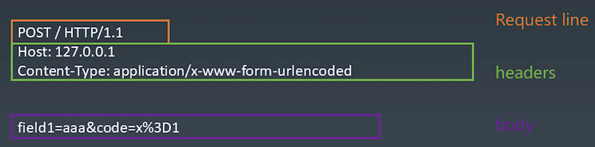

# 学习笔记

## 1. 浏览器总论 | 浏览器工作原理

  ### HTTP 的基础知识 --> 游览器由以下 5 个步骤完成的整体渲染：

  

  > 浏览器的基础渲染流程：
  >
  > 手敲一个 URL，最终显示在屏幕上是一个图片的形式，这个过程叫 Bitmap。
  >
  > Bitmap：当 Bitmap 最后传给显卡驱动设备，才会转换人眼可识别的光信号。
  >
  > 所有浏览器的目标都是从一个 URL 最后得到一张 Bitmap 的过程是浏览器的基础渲染流程。
  >
  >  Toy-Browser

## 2. 状态机 | 有限状态机

  ### 有限状态机

  * 每一个状态都是一个机器
    - 在每一个机器里，我们可以做计算、存储、输出……
    * 所有的这些机器接受的输入是一致的
    - 状态机的每一个机器本身没有状态，如果我们用函数来表示的话，它应该是出函数（无副作用）
  - 每一个机器知道下一个状态
    * 每个机器都有确定的下一个状态 （Moore）
    - 每个机器根据输入决定下一个状态 （Mealy）
      * JS 中的有限状态机（Mealy）
        <pre>
          // 每个函数是一个状态
          function state(input) { // 函数输入就是输入
            // 在函数中，可以自由的编写代码，处理每个状态的逻辑
            return next; // 返回值作为下一个状态
          }
          // 以下是调用
          while(input) {
            // 获取输入
            state = state(input); // 把状态机的返回值作为下一个状态
          }
        </pre>

## 3. 状态机 | 不使用状态机处理字符串（一）

  * 在一个字符串中，找到 “a”

    <pre>
      function match(string) {
        for (let c of string) {
          if (c == "a") {
            return true;
          }
        }
        return false;
      }
      match("i am groot");
    </pre>

## 4. 状态机 | 不使用状态机处理字符串（二）

  - 在一个字符串中，找到字符 “ab”，不能使用正则表达式
  
    <pre>
      function match(string) {
        let foundA = false;
        for (let c of string) {
          if (c == "a") {
            foundA = true;
          }
          else if (foundA && c == "b") {
            return true;
          }
          else {
            foundA = false;
          }
        }
        return false;
      }
      console.log(mathc("i abm grood"));
    </pre>

## 5. 状态机 | 不使用状态机处理字符串（三）

  * 在一个字符串中，找到字符 “abcdef”，不能使用正则表达式

    <pre>
      function match(string) {
        let foundA = false;
        let foundB = false;
        let foundC = false;
        let foundD = false;
        let foundE = false;
        for (let c of string) {
          if (c == "a") {
            foundA = true;
          }
          else if (c == "b") {
            foundB = false;
          }
          else if (c == "c") {
            foundC = false;
          }
          else if (c == "d") {
            foundD = false;
          }
          else if (c == "e") {
            foundE = false;
          }
          else if (c == "f") {
            return true;
          }
          else {
            foundA = false;
            foundB = false;
            foundC = false;
            foundD = false;
            foundE = false;
          }
        }
        return false;
      }
      console.log(match("ababcdefg"));
    </pre>

## 6. 状态机 | 使用状态机处理字符串（一）

  - 在一个字符串中，找到字符 “abcdef”，不能使用正则表达式

    <pre>
      function match(string) {
        let state = start;
        for (let c of string) {
          // 把状态切到下一个
          state = start(c);
        }
        // 判断是不是已经找到了所有的状态
        return state === end;
      }
      function start(c) {
        if (c === "a") {
          return foundA;
        } else {
          return start;
        }
      }
      function end(c) {
        // 小技巧（trap）：让 end 状态永远返回 end，一旦进入到 end 状态就再也不会进别的状态
        return end;
      }
      function foundA(c) {
        if (c === "b") {
          return foundB;
        } else {
          return start(c); // 重新使用的逻辑 —— reConsume 逻辑
        }
      }
      function foundB(c) {
        if (c === "c") {
          return foundC;
        } else {
          return start(c);
        }
      }
      function foundC(c) {
        if (c === "d") {
          return foundD;
        } else {
          return start(c);
        }
      }
      function foundD(c) {
        if (c === "e") {
          return foundE;
        } else {
          return start(c);
        }
      }
      function foundE(c) {
        if (c === "f") {
          // 结束状态
          return end;
        } else {
          return start(c);
        }
      }
      console.log(match("ababcdefg"));
    </pre>

## 7. 状态机 | 使用状态机处理字符串（二）

  * 如何用状态机处理诸如 “abcabx” 这样的字符串？（状态机处理重复字符串）

    <pre>
      function match(string) {
        let state = start;
        for (let c of string) {
          state = start(c);
        }
        return state === end;
      }
      function start(c) {
        if (c === "a") {
          return foundA;
        } else {
          return start;
        }
      }
      function end(c) {
        return end;
      }
      function foundA(c) {
        if (c === "b") {
          return foundB;
        } else {
          return start(c);
        }
      }
      function foundB(c) {
        if (c === "c") {
          return foundC;
        } else {
          return start(c);
        }
      }
      function foundC(c) {
        if (c === "a") {
          return foundA2; // 找到第二个 a 的状态
        } else {
          return start(c);
        }
      }
      function foundA2(c) {
        if (c === "b") {
          return foundB2;
        } else {
          return start(c);
        }
      }
      function foundB2(c) {
        if (c === "x") {
          return end;
        } elsel {
          return foundB;
        }
      }
      console.log(match("abcabcabx"));
    </pre>
  - 额外内容

    * 我们如何用状态机处理诸如 “abcabx” 这样的字符串？
    - 作业：使用状态机完成 “abababx” 的处理。
    * 可选作业：我们如何用状态机处理完全未知的 pattern？
      - 参考资料：[字符串 KMP 算法](https://en.wikipedia.org.wiki.Knuth%E2%80%93Morris%E2%80%93Pratt_algorithm)

## 8. HTTP 请求 | HTTP 的协议解析
  
  * IOS - OSI 七层网络模型

    

  - TCP 与 IP 的一些基础知识
    * 流

      > 包
    - 端口
      
      > IP 地址      
    * require("net");
      
      > libnet ( 负责构造 IP 包并且发送 ) / libpcap ( 复负责从网卡抓所有的流经你电脑的网卡 IP 包 )

  * HTTP

    > TCP：全双工通道；全双工你可以给我发，我也可以给你发，不存在优先关系。  
    > HTTP：必须得先由客服端发起一个 request ，然后服务端回来一个 response。

    - Request
    * Response

## 9. HTTP 请求 | 服务端环境准备

  - 服务端环境的搭建

    <pre>
      const http = require("http");
      http.createServer((request, response) => {
        let body = [];
        request.on("errer", err => {
          console.log(err);
        }).on("data", chunk => {
          body.push(chunk.toString());
        }).on("end", () => {
          body = Buffer.concat(body).toString();
          console.log("body：", body);
          response.writeHead(200, {"Content-Type": "text/html"});
          response.end("Hello World\n");
        });
      }).listen(8088);
      console.log("server started", http);
    </pre>

  * 了解 HTTP 协议的 request 部分

    > HTTP 协议：是一个文本型的协议，文本型协议一般是跟二进制型协议相对的，文本型协议里面所有的内容都是字符串。

    

## 10. HTTP 请求 | 实现一个 HTTP 的请求

  - 第一步 HTTP 请求总结
    * 设计一个 HTTP 请求的类
    - Content-Type 是一个必要的字段，要有默认值
    * body 是 key / value 格式
    - 不同的 Content-Type 影响 body 的格式

    <pre>
      let net = require("net");
      class Request {
        constructor(options) {
          this.method = options.method || "GET";
          this.host = options.host;
          this.post = options.post || "80";
          this.path = options.path || "/";
          this.bosy = options.body || {};
          this.headers = options.headers || {};
          if (!this.headers["Content-Type"]) {
            this.headers["Content-Type"] === "application/-x-www-form-urlencoded";
          }
          if (this.headers["Content-Type"] === "application/json") {
            this.bodyText = JSON.stringify(this.body);
          } else if (this.headers["Content-Type"] === "application/x-www-form-urlencoded") {
            this.bodyText = Object.keys(this.body).map(key => `${key}=${encodeUTLComponent(this.body[key])}`).join("$");
          }
          this.henders["Content-Length"] = this.bodyText.length;
        }
        send() {
          return new Promise((resolve, reject) => {
            // ...
          });
        }
      }
      void async function() {
        let request = new Request({
          method: "POST",
          host: "192.168.0.106",
          port: "8088",
          path: "/",
          headers: {
            ["X-Foo2"]: "customed"
          },
          body: {
            name: "cavon"
          }
        });
        let response = await request.send();
        console.log(respones);
      }();
    </pre>
## 11. HTTP 请求 | send 函数的编写，了解 response 格式

  * 第二步 send 函数总结
    - 在 Request 构造器中收集必要的信息
    * 设计一个 send 函数，把请求真实发送到服务器
    - send 函数应该是异步的，所以返回 Promise

    <code>
      let net = require("net");

      class Request {

      }
      void async function() {
        
      }
    </code>

## 12. HTTP 请求 | 发送请求

## 13. HTTP 请求 | response 解析

## 14. HTTP 请求 | response body 的解析